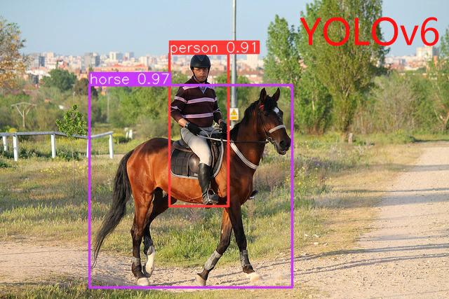
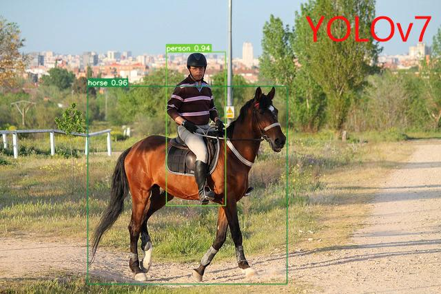
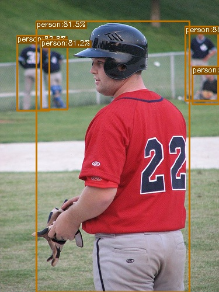

# YOLOv6 && YOLOv7
本项目基于YOLOv6和YOLOv7架构实现 \
在此感谢两位作者--(https://github.com/meituan/YOLOv6) 和 (https://github.com/WongKinYiu/yolov7)

## 简介
YOLOv6 和 YOLOv7相关改进和提升，可以参考 (http://confluence.polarise.cn/pages/viewpage.action?pageId=37915539)

## 训练

### 环境配置
对于 YOLOv6 和 YOLOv7 均可以参考其相关文件 requirements.txt 并按照如下操作;
```shell
pip install -r requirements.txt
```
或者可以拉取docker镜像;
```shell
docker pull maoqijinwanzao3/pytorch:mobilevit-yolov6-py3.8-torch11.0-cu113  # yolov6
docker pull hub.polarise.cn/polarizon-ai/gendo-pgai/pytorch/yolov7 # yolov7
```

### 训练模块
本项目基于COCO数据集--train数据集 进行训练
#### YOLOv6

单GPU训练
```shell
python yolov6/tools/train.py --batch 32 --conf configs/yolov6s.py --data data/coco.yaml --device 0
```
多GPU训练(需要使用DDP模块)
```shell
python -m torch.distributed.launch --nproc_per_node 8 yolov6/tools/train.py --batch 256 --conf configs/yolov6s.py --data data/coco.yaml --device 0,1,2,3,4,5,6,7
```
对于 nano 模型
```shell
python -m torch.distributed.launch --nproc_per_node 4 yolov6/tools/train.py \
									--batch 128 \
									--conf configs/yolov6n.py \
									--data data/coco.yaml \
									--epoch 300 \
									--device 0,1,2,3 \
									--name yolov6n_coco
```

对于 small/tiny 模型
```shell
python -m torch.distributed.launch --nproc_per_node 8 yolov6/tools/train.py \
									--batch 256 \
									--conf configs/yolov6s.py \ # configs/yolov6t.py
									--data data/coco.yaml \
									--epoch 400 \
									--device 0,1,2,3,4,5,6,7 \
									--name yolov6s_coco # yolov6t_coco
```
对于 medium/large 模型
```shell
# Step 1: 训练一个预训练模型
python -m torch.distributed.launch --nproc_per_node 8 yolov6/tools/train.py \
									--batch 256 \
									--conf configs/yolov6m.py \ # configs/yolov6l.py
									--data data/coco.yaml \
									--epoch 300 \
									--device 0,1,2,3,4,5,6,7 \
									--name yolov6m_coco # yolov6l_coco
									
                                                                                      
# Step 2: 进行自蒸馏训练
python -m torch.distributed.launch --nproc_per_node 8 yolov6/tools/train.py \
									--batch 256 \ # 128 for distillation of yolov6l 
									--conf configs/yolov6m.py \ # configs/yolov6l.py
									--data data/coco.yaml \
									--epoch 300 \
									--device 0,1,2,3,4,5,6,7 \
									--distill \
									--pretrain_model_path runs/train/yolov6m_coco/weights/best_ckpt.pt \ # # yolov6l_coco
									--name yolov6m_coco # yolov6l_coco
```

#### YOLOv7
数据准备
```shell
bash scripts/get_coco.sh
```
单GPU训练
``` shell
# train p5 models
python yolov7/use/train.py --workers 8 --device 0 --batch-size 32 \
                --data data/coco.yaml \
                --img 640 640 \
                --cfg cfg/training/yolov7.yaml \
                --weights '' \
                --name yolov7 \
                --hyp data/hyp.scratch.p5.yaml \

# train p6 models
# 使用辅助头训练
python yolov7/use/train_aux.py --workers 8 --device 0 --batch-size 16 \
                    --data data/coco.yaml \
                    --img 1280 1280 \
                    --cfg cfg/training/yolov7-w6.yaml \
                    --weights '' \
                    --name yolov7-w6 \
                    --hyp data/hyp.scratch.p6.yaml \
```
多GPU训练
``` shell
# train p5 models
python -m torch.distributed.launch --nproc_per_node 4 --master_port 9527 yolov7/use/train.py --workers 8 --device 0,1,2,3 --sync-bn --batch-size 128 \
                                                                                  --data data/coco.yaml \
                                                                                  --img 640 640 \
                                                                                  --cfg cfg/training/yolov7.yaml \
                                                                                  --weights '' \
                                                                                  --name yolov7 \
                                                                                  --hyp data/hyp.scratch.p5.yaml \

# train p6 models
# 使用辅助头训练
python -m torch.distributed.launch --nproc_per_node 8 --master_port 9527 yolov7/use/train_aux.py --workers 8 --device 0,1,2,3,4,5,6,7 --sync-bn --batch-size 128 \
                                                                                      --data data/coco.yaml \
                                                                                      --img 1280 1280 \
                                                                                      --cfg cfg/training/yolov7-w6.yaml \
                                                                                      --weights '' \
                                                                                      --name yolov7-w6 --hyp data/hyp.scratch.p6.yaml \
```

### 测试模块
本项目基于COCO数据集--val数据集 进行测试评估
#### YOLOv6
对于 yolov6 模型
``` shell
python yolov6/tools/eval.py --weights yolov6s.pt --data data/coco.yaml --device 0 --batch-size 32
```
可以得到结果样例
```shell
 Average Precision  (AP) @[ IoU=0.50:0.95 | area=   all | maxDets=100 ] = 0.403
 Average Precision  (AP) @[ IoU=0.50      | area=   all | maxDets=100 ] = 0.568
 Average Precision  (AP) @[ IoU=0.75      | area=   all | maxDets=100 ] = 0.439
 Average Precision  (AP) @[ IoU=0.50:0.95 | area= small | maxDets=100 ] = 0.209
 Average Precision  (AP) @[ IoU=0.50:0.95 | area=medium | maxDets=100 ] = 0.453
 Average Precision  (AP) @[ IoU=0.50:0.95 | area= large | maxDets=100 ] = 0.566
 Average Recall     (AR) @[ IoU=0.50:0.95 | area=   all | maxDets=  1 ] = 0.334
 Average Recall     (AR) @[ IoU=0.50:0.95 | area=   all | maxDets= 10 ] = 0.553
 Average Recall     (AR) @[ IoU=0.50:0.95 | area=   all | maxDets=100 ] = 0.606
 Average Recall     (AR) @[ IoU=0.50:0.95 | area= small | maxDets=100 ] = 0.382
 Average Recall     (AR) @[ IoU=0.50:0.95 | area=medium | maxDets=100 ] = 0.680
 Average Recall     (AR) @[ IoU=0.50:0.95 | area= large | maxDets=100 ] = 0.794
```
#### YOLOv7
对于 yolov7 模型
``` shell
python yolov7/use/test.py --data data/coco.yaml --img 640 --batch 32 --conf 0.001 --iou 0.65 --device 0 --weights yolov7.pt --name yolov7_640_val
```
可以得到结果样例
```shell
 Average Precision  (AP) @[ IoU=0.50:0.95 | area=   all | maxDets=100 ] = 0.51206
 Average Precision  (AP) @[ IoU=0.50      | area=   all | maxDets=100 ] = 0.69730
 Average Precision  (AP) @[ IoU=0.75      | area=   all | maxDets=100 ] = 0.55521
 Average Precision  (AP) @[ IoU=0.50:0.95 | area= small | maxDets=100 ] = 0.35247
 Average Precision  (AP) @[ IoU=0.50:0.95 | area=medium | maxDets=100 ] = 0.55937
 Average Precision  (AP) @[ IoU=0.50:0.95 | area= large | maxDets=100 ] = 0.66693
 Average Recall     (AR) @[ IoU=0.50:0.95 | area=   all | maxDets=  1 ] = 0.38453
 Average Recall     (AR) @[ IoU=0.50:0.95 | area=   all | maxDets= 10 ] = 0.63765
 Average Recall     (AR) @[ IoU=0.50:0.95 | area=   all | maxDets=100 ] = 0.68772
 Average Recall     (AR) @[ IoU=0.50:0.95 | area= small | maxDets=100 ] = 0.53766
 Average Recall     (AR) @[ IoU=0.50:0.95 | area=medium | maxDets=100 ] = 0.73549
 Average Recall     (AR) @[ IoU=0.50:0.95 | area= large | maxDets=100 ] = 0.83868
```

### 推理模块
本项目随机从网上抓取推理图片，后附部分实验结果
#### YOLOv6
``` shell
python yolov6/tools/infer.py --weights yolov6s.pt --source data/images
```
图片示意：

<div align="center">
    <a href="./">
        
    </a>
</div>


#### YOLOv7
``` shell
python yolov7/use/detect.py --weights yolov7.pt --conf 0.25 --img-size 640 --source inference/images/
```
图片示意：

<div align="center">
    <a href="./">
        
    </a>
</div>

### 量化推理
#### YOLOv6
详细推理量化过程见(http://git.polarise.cn/projects/AI/repos/yolov6-tensorrt/browse)
#### YOLOv7
YOLOv7 未能实现基于C++的量化推理，仅支持基于python的量化推理 \
先将.pt 文件转换成 .onnx 文件
```shell
python yolov7/qua/pt2onnx_export.py --wegights '' --img-size 640 --batch-size 1 \
                                    --end2end \
                                    --simplify \
                                    --device 0
```
再将 .onnx 文件转化成基于python的 trt engine 文件
```shell
python yolov7/qua/onnx2trt_export.py -o ${onnx path} -e ${output path} \
                                     --end2end ${if export .onnx with end2end} \
                                     -p fp16 or fp32 or int8 \
                                     #如果选择int8量化需要配置以下超参数
                                     --calib_input ${input path for images to use for calibration} \
                                     --calib_cache ${output path for calibration.cache} \
                                     --calib_batch_size \
                                     --calib_num_images ${the maximum number of images to use for calibration} \
```
最后将得到的TRT engine文件进行推理测试
```shell
python yolov7/qua/test_trt.py -e ${trt engine path} \
                              -s ${input images path} \
                              -o ${output images path} \
                              --end2end ${if engine is end2end}
```
可得到推理平均时间和推理结果图片，推理结果图片示意如下
<div align="center">
    <a href="./">
        
    </a>
</div>


